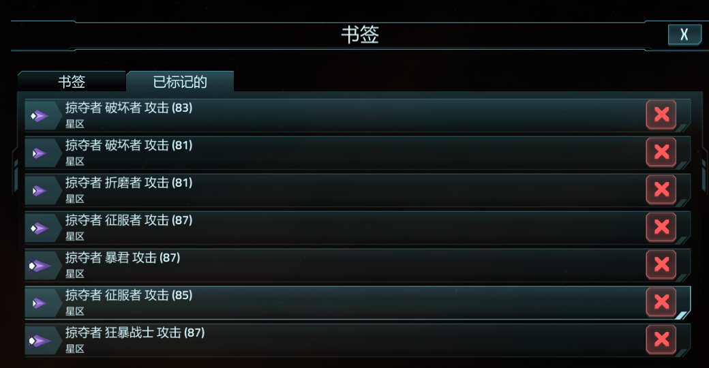
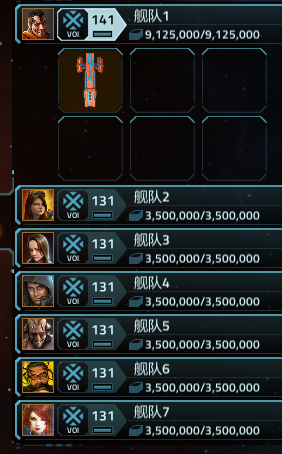
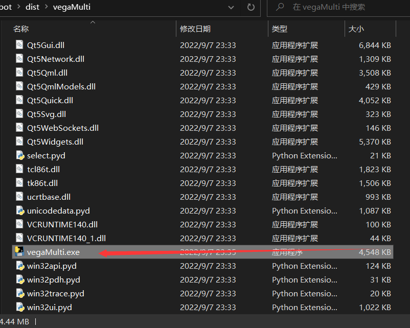

# 维卡冲突自动打怪脚本

脚本可以指定舰队攻击特定的船体，高效刷活动、蓝图。

# 前置条件
1. steam版
2. 全屏
3. 分辨率1920 * 1080
4. 语言为中文

# 跟淘宝vega助手相比的优点
0. 免费！免费！免费！
1. 效率高：经过测试7队刷T11活动一小时220w情报
2. 配置灵活：可以不同船队打不同的怪，你甚至可以用这个脚本一晚上刷7个无畏。当然7个队伍刷同一个怪也是可以的。
3. 多次迭代考虑了容错，可以自动修船、关闭闪击者、忽略基地被攻击警告。
4. 智能，缩小了找图范围，让你家cpu多活两天

# 为什么脚本只有命令行端而且没有全局热键
1. 懒

# 使用方法

1. 将你需要打的怪全部标记上，如图
最多标记7个（你只有7个队伍），从上往下记为编号1-7，只标记1个也可以7队刷同一个怪
2. 准备好你的舰队
3. 启动脚本，双击它
4. 输入你的舰队编号和对应要攻击的npc
如图中是1 2船队刷1号npc，3 4船队刷2号npc，5 6 7船队分别刷3 4 5npc
5. 回车后切换到游戏界面即可

